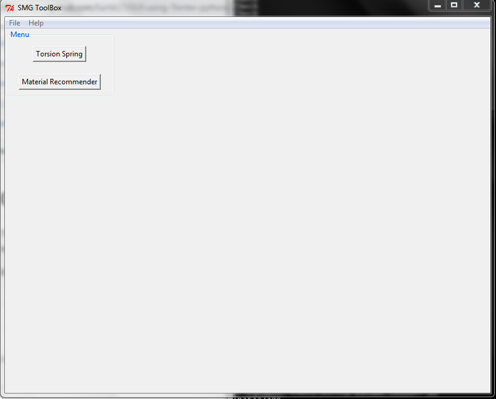
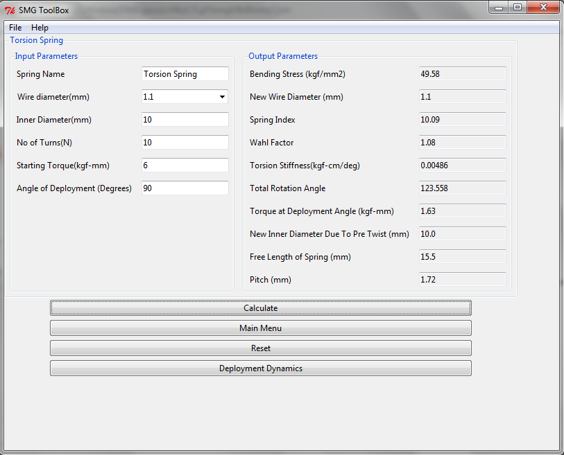
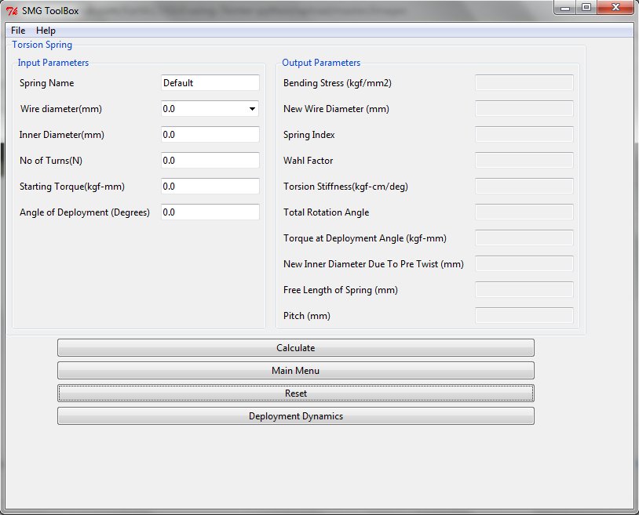

# GUI - Tkinter

The repository contains code for the development of a GUI to automate the work done by a design engineer. Presently, the work includes 
only the design calculation of a Torsion spring and will grow over the period of time.

Run using Tkinter.py file.

